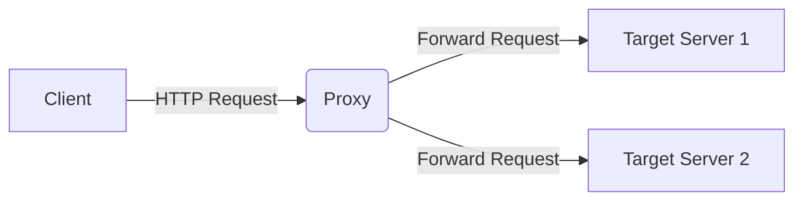

# 什么是Diff工具
Diff 用于充当代理，将收到的任何请求，发送到两个正在运行的实例。然后，它会比较响应。并比较两个响应不同的部分。

# 如何使用
1、构建并启动
```shell
go build .

./go-diff &
```
2、go-diff 默认端口为18080，将请求流量转发至go-diff，go-diff则会将请求同时转发到配置文件中的host1和host2，并对比响应体

3、结果接口
http://127.0.0.1:19090/chart
http://127.0.0.1:19090/metrics


# 配置文件
默认为同路径下的`config.yaml`
```yaml
# use environment variables first
self_port: ${PORT::18080}
host1: ${BACKEND_SERVICE1:http://127.0.0.1:8080} # 目标地址A
host2: ${BACKEND_SERVICE2:http://127.0.0.1:8081} # 目标地址B
headers_include: ${HEADER_INCLUDE:} # 需要比对的response header
compare_status_code: ${ENABLE_STATUS_CHECK:true}  # 是否比对http status
equivalent_status_codes: ${STATUS_CODES:400,404;500,502} # 哪些status 可以被认为是相同含义并忽略
compare_body: ${COMPARE_BODY:true} # 是否比对response body
bodies_exclude: ${BODY_EXCLUDE:} # 针对 json body， 哪些字段可以被忽略比对

```

json body的字段填写规则
```json
{
  "a": { "b": { "c": { "x": 1, "y": 2, "z": 3 } } }
}
```
/a/b/c/x
/a/b/c/y
/a/b/c/z

更多详细规则，详见引用[json diff](https://github.com/wI2L/jsondiff)


配合[`go replay`](https://github.com/buger/goreplay)工具食用更佳
示例
```shell
./gor --input-raw :80 \
--output-http "http://127.0.0.1:18080" \
--http-allow-url '^/api/user' \
--http-original-host \
--input-raw-realip-header "X-Real-IP" \
--exit-after 5s
```
