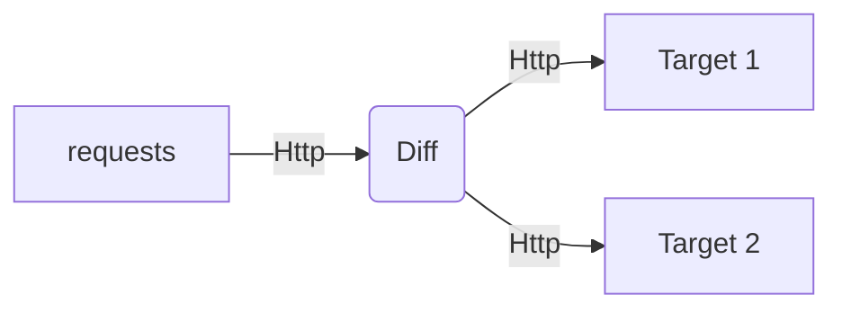

# 什么是Diff工具
Diff 用于充当代理，将收到的任何请求，发送到两个正在运行的实例。然后，它会比较响应。并比较两个响应不同的部分。

# 如何使用
1、构建并启动
```shell
go build .

./go-diff &
```
2、go-diff 默认端口为18080，将请求流量转发至go-diff，go-diff则会将请求同时转发到配置文件中的host1和host2，并对比响应体输出到日志`diff.log`

# 配置文件
默认为同路径下的`config.json`
```json
{
  "host1": "http://localhost:8081", // 目标地址A
  "host2": "http://localhost:8081", // 目标地址B
  "headers_include": [  // 表示要比对的response header
    "Content-Type",
    "Content-Length"
  ],
  "compare_status_code": true,  // 是否比对response status
  "equivalent_status_codes": [  // 哪些status 可以被认为是相同含义并忽略，如示例 400与401可看作相同含义
    [
      400,
      401
    ]
  ],
  "compare_body": false,  // 是否比对response body
  "bodies_exclude": [   // 针对 json body， 哪些字段可以被忽略比对
    "/secret",
    "/uniqueId"
  ]
}

```
json body的字段填写规则
```json
{
  "a": { "b": { "c": { "x": 1, "y": 2, "z": 3 } } }
}
```
/a/b/c/x
/a/b/c/y
/a/b/c/z

更多详细规则，详见引用[json diff](https://github.com/wI2L/jsondiff)

配合[`go replay`](https://github.com/buger/goreplay)工具食用更佳
